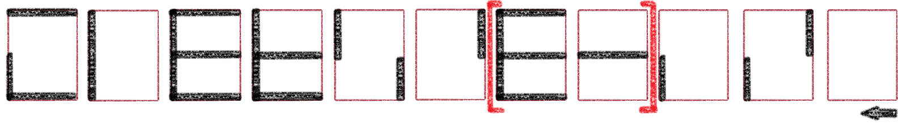
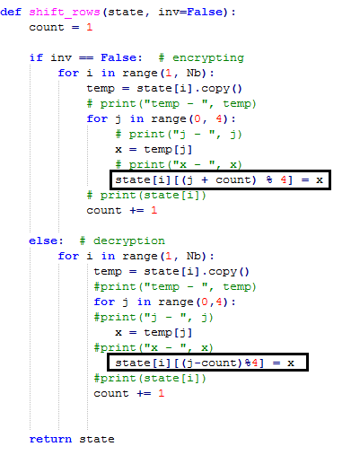

Участникам выдается программа, написанная на python, шифровка последовательности, определяющей порядок ключей.
Сначала участникам предстоит восстановить их последовательность ключей:

В зашифрованной последовательности обведены линии, которые не входят в графическое изображение цифры. Участникам будут даны ключи (их можно найти в программе):

0x2b, 0x7e, 0x15, 0x16, 0x28, 0xae, 0xd2, 0xa6, 0xab, 0xf7, 0x15, 0x88, 0x09, 0xcf, 0x4f, 0x3c
Однако, имея правильную последовательность ключей, участникам предстоит понять, в каком порядке следуют ключи: в прямом или обратном? Это легко проверить, но не на данном этапе, т.к. в алгоритм закралась ошибка!

Нужно поднять документацию и понять, что:

Право это лево, а лево это право! А именно ошибка в сдвиге, поэтому просто меняем плюс на минус и наоборот! Далее определяем прямой или обратный порядок ключей и получаем флаг, путем простых манипуляций с кодом!
