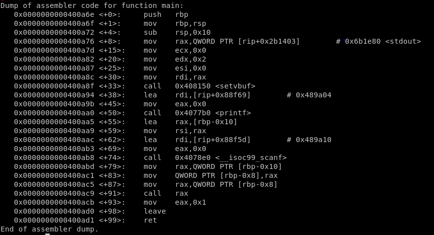
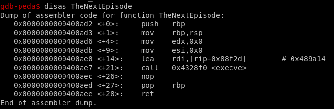

Посмотрим дизассемблирование главной функции main

Понятно, что функция считывает адрес и вызывает функцию по нему

Рассмотрим, какие функции есть в программе и среди них найдем функцию под названием TheNextEpisode

Видим, что происходит вызов шелла, переводим адрес функции к десятеричному виду, передаем программе и получаем шелл.