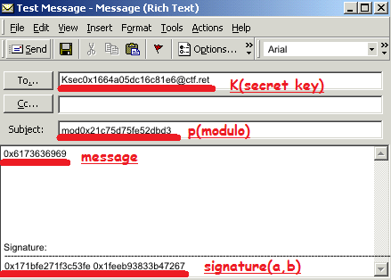
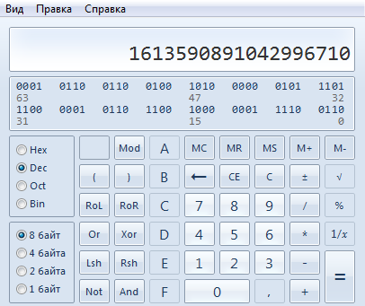
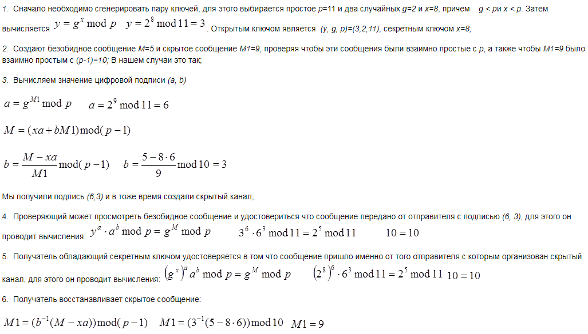

Внимательно изучаем письмо.

Видим некоторые значения в hex. С помощью калькулятора переводим их в dec. Слово “signature” наталкивает нас на мысль, что нам дана подпись с параметрами.

Ниже приведен алгоритм подписи Эль-Гамаля:

Используя алгоритм, описанный выше, восстанавливаем сообщение. Например, программно реализовав подпись.

По факту, необходима всего одна формула из пункта 6.
