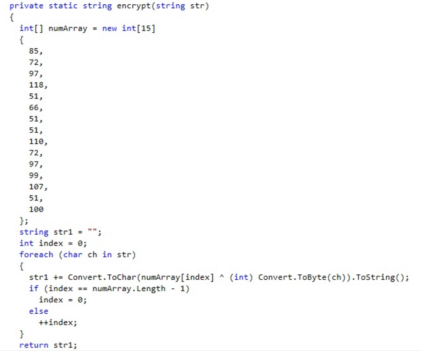
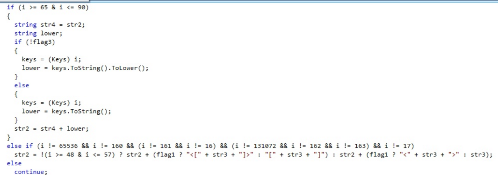
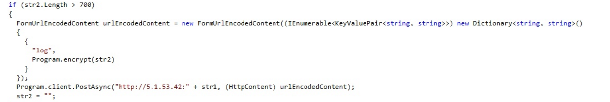
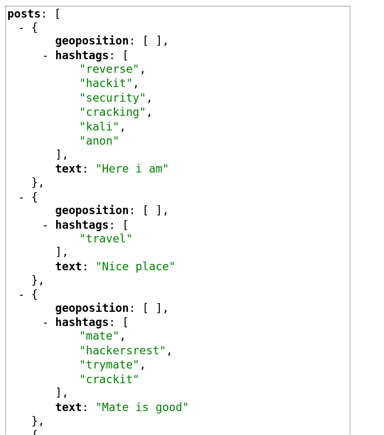

You have been hacked I

Два файла: RAR-архив с неизвестной мальварью и зашифрованный пакет с данными, который был отправлен с компьютера жертвы после распаковки этого архива.
Изучив архив можно понять,что это никакой не RAR, а [ACE](https://en.wikipedia.org/wiki/ACE_(compressed_file_format)).

Недавно в WinRAR была обнаружена уязвимость, связанная как раз с этим форматом(CVE-2018-20250): в архив можно поместить файл, который распакуется в укзанную заранее директорию, игонрируя пользовательский выбор.

В нашем случае это exe, который хранится в архиве в открытом виде, так что вычленить его оказывается не проблемой, так же как и декомпилировать в C# код.

Теперь у нас в руках исходный код явного кейлоггера

Ценность представляют три выделенных особенности
1. Метод encrypt, выполняющий простой xor входной строки с заранее заданным массивом чисел. Знание этого массива и способа "шифрования" уже достаточно для расширофки пакета.

3. Способ записи логируемого текста. Это поможет нам в преобразовании флага в исходный вид.
Картинка кода
(где flag1 - зажатый shift)

Флаг: TyumenCTF{an0th3r_oNe_m@lware}

5. Адрес, на который уходили данные.

И здесь мы переходим ко второму таску на OSINT.
на порту висит веб сервис, но на все попытки перебора путей получаем 404.

От нечего делать перепроверим все файлы, включая пустышки из архива, в мета данных одной из которых найдем автора документа - flagutin.

Поиск по сервисам дает нам аккаунт на [Gitlab](https://gitlab.com/flagutin/information_gathering_service) с единственным репозиторием, откуда мы и узнаем правильный url. Единственное что мы не знаем это обязательный аргумент api_key, но который легко находится в ранних коммитах.

Изучая хранящуюся информацию мы натыкаемся на:

Перебрав хэштеги в instagram  обнаруживается аккаунт с флагом в bio
Флаг: TyumenCTF{C@ts_&_m0us3s}
 
